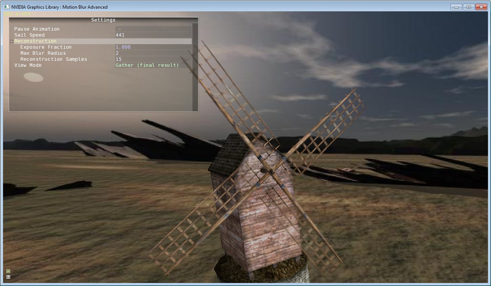
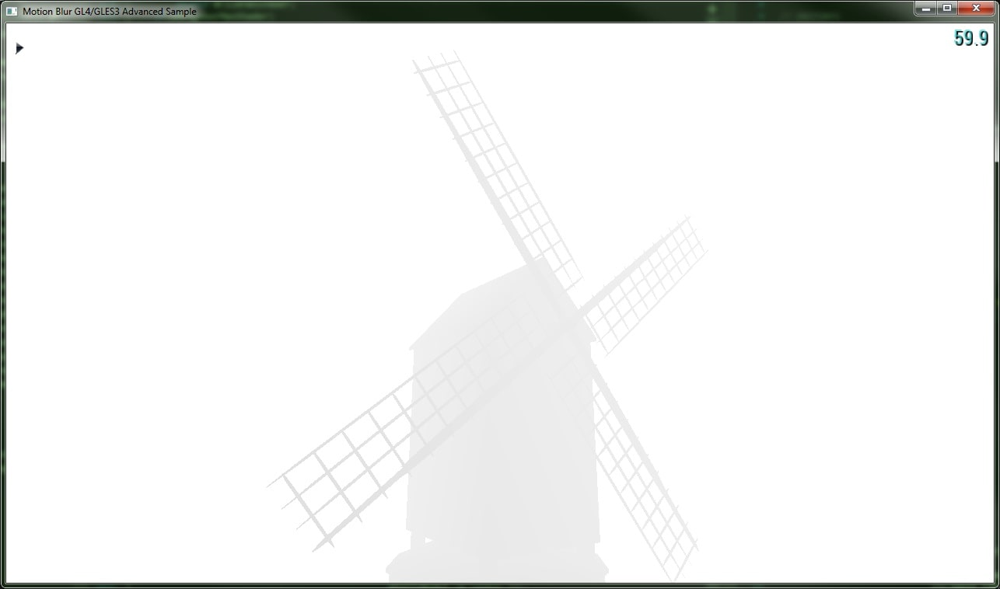
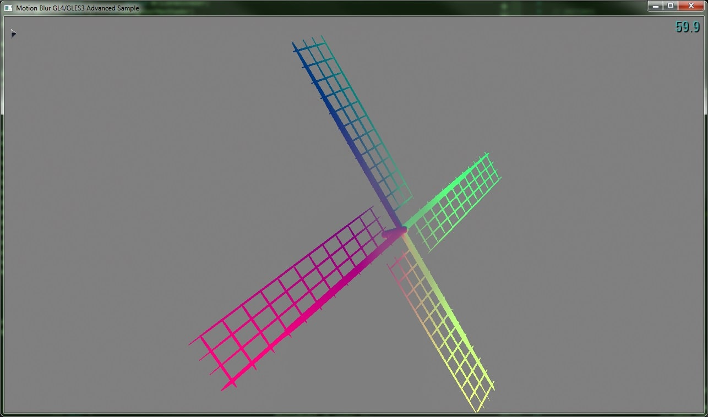
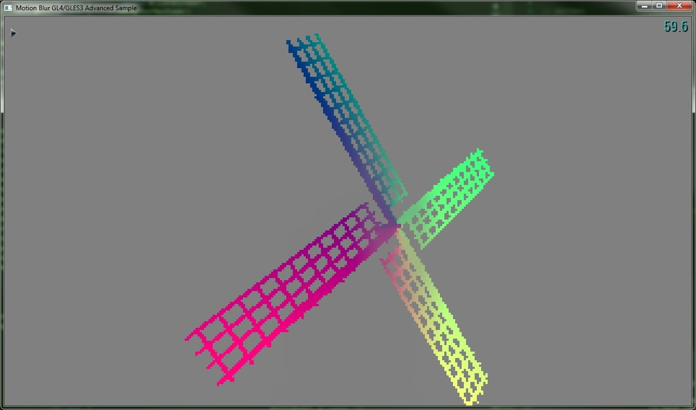
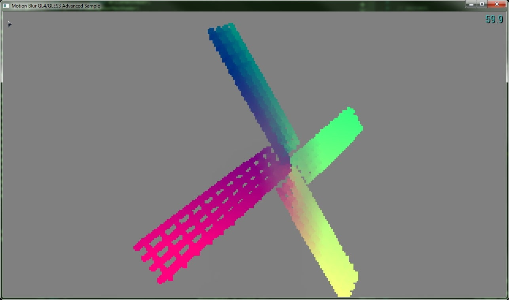
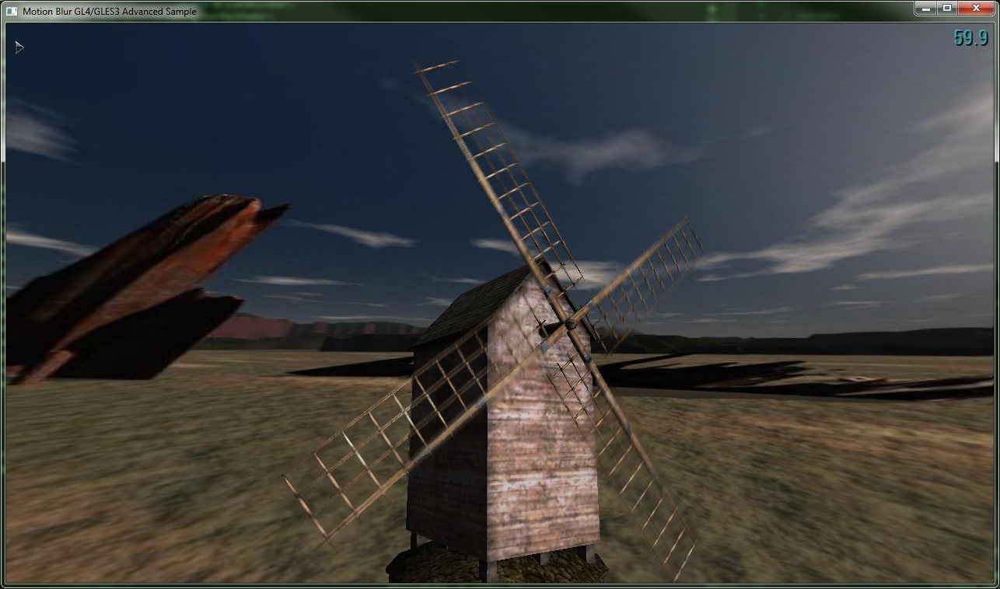

# Motion Blur D3D Advanced Sample

**Category**:  Visuals  
**Min PC GPU**: Fermi-based (GTX 4xx)  

## Description  

This sample shows a filtering method for simulating motion blur of fast-moving objects. The method used is a 2D full-screen post-process that works on a normal framebuffer augmented with a screen-space velocity buffer; thus, filtering performance is not dependent on scene geometric complexity. The algorithm is based on the paper 'A Reconstruction Filter for Plausible Motion Blur', by McGuire et. al. (SIGGRAPH I3D'12).  

  

## APIs Used  

- D3D11  

## App-Specific Controls

This sample has the following app-specific controls:  

| Device   | Input                | Result                   |  
|:-        |:-                    |:-                        |  
| mouse    | Left-Click Drag      | Rotate the scene         |  
| mouse    | Middle Button Scroll | Zoom the scene           |  
| keyboard | F1                   | Toggle onscreen UI       |  
| keyboard | Tab                  | Toggle performance stats |  

## Technical Details  

### Introduction  

This sample is an implementation of a plausible reconstruction filter for motion blur. It is a 2D multi-pass post-process implemented mostly in a GPU shader language, which has the following advantages over competing alternatives:  

- Since it is a 2D post-process, it does not require significant changes to a rendering pipeline when inserting it.  
- Since it does not require scene-dependent computations (other than the creation of the vertex half-velocity buffer), its performance is not tied to scene complexity, but rather to screen resolution  
- For the same reasons as above, it can be used on an entire scene (as opoposed to being enabled on specific scene objects, like the OpenGL sample "Motion Blur ES2" does).  
- Since motion blur is computed in screen space, the motion blur effect can be made specific to what is being tracked by the camera. For example, if the virtual camera pose is attached to a moving scene object, the objects not moving in relation to the camera (i.e. the moving scene object the camera is attached to) will not be blurred, but the rest of the environment will. Conversely, if the virtual camera is attached to a stationary pose in the scene, only moving objects will be blurred.  

The algorithm takes the following as inputs:  

- A set of buffers (from previous render trarget operations) containing the color, depth and vertex half-velocities of the objects in the scene (this is the only scene-complexity-dependent step in the algorithm, from a performance point of view).  
- A maximum motion blur radius K (suggested values around 20).  
- An odd number of reconstruction filter sample taps S (suggested values around 15).  

  

Figure 1: Color buffer (Click to enlarge)  

  

Figure 2: Depth buffer (Click to enlarge)  

  

Figure 3: Half-velocity buffer (Click to enlarge)  

### Algorithm overview

Once the color buffer C, depth buffer Z and vertex half-velocity buffer V (all of size w and h) have been generated, the algorithm performs the following passes:  

1. TileMax(V):  
    - Takes the vertex half-velocities V as input.  
    - It is a downsampling pass: it produces a buffer of size (w/K, h/K), where each pixel represents a tile.  
    - Each tile stores the dominant (i.e. highest magnitude) half-velocity for all the original values within that tile.  

  

Figure 4: TileMax pass output (Click to enlarge)

2. NeighborMax(TileMax):  
    - Takes the output of TileMax(V) as input.  
    - Both input and output buffers are of size (w/K, h/K).  
    - Each tile's dominant half-velocity is compared against its neighbors', and it stores the highest dominant half-velocity found. This effectively "smears" the highest velocities onto other neighboring tiles.  

  

Figure 5: NeighborMax pass output (Click to enlarge)

3. Final gathering (reconstruction) pass:  
    - It takes C, V, Z and NeighborMax as inputs.  
    - Its output goes directly to the default framebuffer (or to other post-processes, if appropriate), using the entire screen size.  
    - Each output pixel is blurred in the direction of the dominant half-velocity for its tile (obtained from NeighborMax). This is done by selecting S pixels in a pseudorandom fashion along that dominant half-velocity, and the selected pixel is then weighted against the current one. This weighing takes into account depth differences and ordering (by consulting Z).  

  

Figure 6: Final reconstruction pass output (Click to enlarge)  

### Using our sample implementation  
  
In addition to the shared controls above, the following items have been added to the TweakBar:  

- **Pause Animation**: Pauses the windmill sails' movement (though it still allows for motion blur to be computed and displayed).  
- **Sail Speed**: Changes the angular speed of the windmill sails.  
- **Exposure Fraction**: Changes the exposure (fraction of a frame that represents the amount of time the camerais receiving light, thus creating motion blur).  
- **Max Blur Radius**: Number of tiles created in TileMax pass (K).  
- **Reconstruction Samples**: Number of sample taps obtained along the dominant half-velocity of the tile for a single output pixel (S).  
- **View Mode**: Selects a specific buffer visualizations to be rendered. Available: "Color only", "Depth only", "Velocity", "Velocity TileMax", "Velocity NeighborMax", and "Gather (final result)".  

## See Also  

- [McGuire M., Hennessy P., Bukowski M., Osman B.: A reconstruction filter for plausible motion blue. In I3D (2012), pp. 135-142.](https://casual-effects.com/research/McGuire2012Blur/index.html)  
